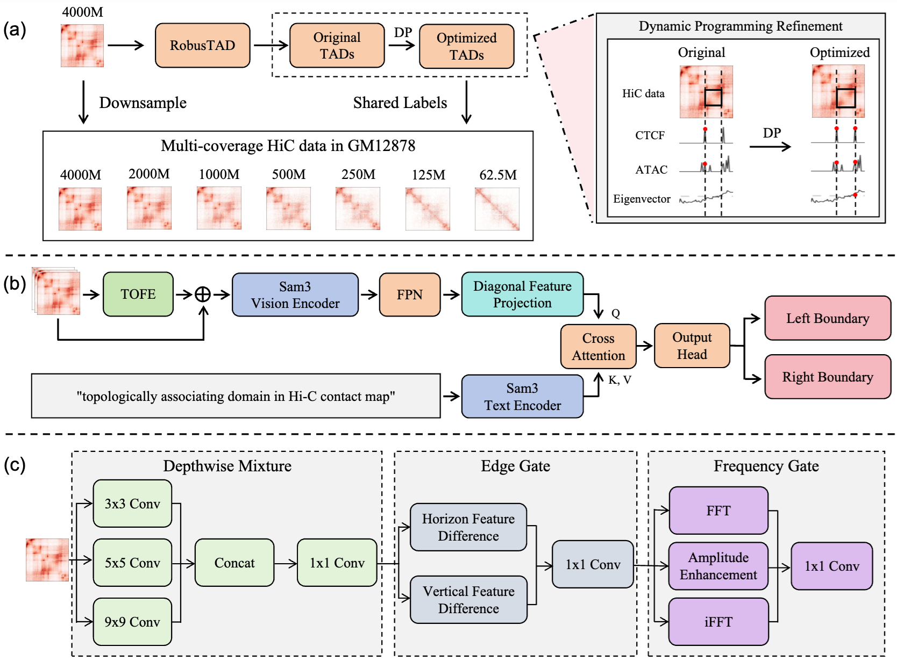
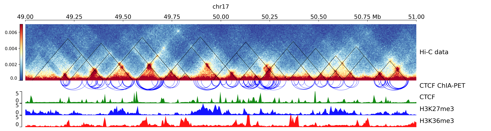

# ContextTAD

ContextTAD is a deep-learning TAD caller that learns boundary evidence from broader local Hi-C windows that capture TAD-scale structural context. Instead of treating boundary prediction as an isolated per-bin classification problem, ContextTAD uses a context-aware representation to produce left- and right-boundary tracks that are explicitly optimized for downstream TAD assembly.




**An example visualization of ContextTAD**:


## Repository layout

```text
ContextTAD/
├── 0-data/
├── 1-prepare_data/
│   ├── step1_process_data/
│   ├── step2_prepare_labels/
│   └── step3_build_gt/
├── 2-training/
│   ├── core/
│   ├── step1_train/
│   └── step2_infer_decode/
├── 3-evaluation/
│   ├── common/
│   ├── step1_main_results_vs_tools/
│   └── step2_model_ablation_ours_only/
└── 5-fullpipeline/  # will be renamed to 4-pipeline
```

## Environment setup (single environment)

Create a conda environment named `contexttad`.

```bash
conda create -n contexttad python=3.12 -y
conda activate contexttad
pip install -r requirements.txt
```

`requirements.txt` is exported from the working training environment (`3dgenome`), and is provided at:

- `requirements.txt`

Additional external tools required by some evaluation/plotting scripts:

- `Rscript` (for structural protein enrichment, `exp2_struct_protein`)
- `coolpup.py` (for coolpup pileups, `exp5_coolpup`)
- `pyGenomeTracks` (for genome track visualizations)

### Download SAM3 configuration and weights

Download SAM3 model files from:

- https://huggingface.co/facebook/sam3/tree/main

## Data preparation

**Note: Most of our data have be uploaded in Zenodo: https://doi.org/10.5281/zenodo.19062598, you only need download `.mcool` data from 4DN.**

Detailed data layout is documented in:

- `0-data/README.md`

The pipeline expects:

- `0-data/1_dp_train_infer_data` (training/inference arrays and labels)
- `0-data/2_eval_tads_data` (evaluation assets)

### Step 1: build GM12878 training/inference arrays

```bash
export TAD_DATA_DIR=/path/to/TADAnno_for_publish/0-data/1_dp_train_infer_data
export MCOOL_TEMPLATE="/path/to/mcool/4DNFIXP4QG5B_Rao2014_GM12878_frac{frac}.mcool"

python 1-prepare_data/step2_prepare_labels/scripts/prepare_data.py
```

Optional modes:

```bash
python 1-prepare_data/step2_prepare_labels/scripts/prepare_data.py --only-4000M
python 1-prepare_data/step2_prepare_labels/scripts/prepare_data.py --skip-4000M
```

### Step 2: build other-celltype inference windows (optional, for cross-cell evaluation)

```bash
python 1-prepare_data/step1_process_data/scripts/prepare_othercell_inference_data.py \
  --mcool /path/to/K562_or_IMR90.mcool::/resolutions/5000 \
  --out_data_dir /path/to/TADAnno_for_publish/0-data/1_dp_train_infer_data/other_celltypes/K562 \
  --coverage_tag K562
```

Repeat for `IMR90` with `--coverage_tag IMR90`.

### Step 3: build merged GT BED from labels

```bash
export TAD_DATA_DIR=/path/to/TADAnno_for_publish/0-data/1_dp_train_infer_data
python 1-prepare_data/step3_build_gt/scripts/build_ground_truth.py
```

## Data sources and accessions

Reference paper used to align data sourcing style:

- RefHiC: https://www.nature.com/articles/s41467-022-35231-3

The following identifiers/files are used in this project data tree.

| Category | Dataset / Cell line | Identifier or file used | Source |
|---|---|---|---|
| Hi-C mcool | GM12878 (Rao2014) | `4DNFIXP4QG5B_Rao2014_GM12878_frac1.mcool` (+ downsampled fractions) | 4DN Data Portal |
| Hi-C mcool | K562 (Rao2014) | `4DNFI4DGNY7J_Rao2014_K562_300M.mcool` | 4DN Data Portal |
| Hi-C mcool | IMR90 (Rao2014) | `4DNFIJTOIGOI_Rao2014_IMR90_1000M.mcool` | 4DN Data Portal |
| CTCF ChIP-seq | GM12878 | `ENCFF796WRU_GM12878.bed_CTCF_5kb+.bed`, `ENCFF796WRU_GM12878.bed_CTCF_5kb-.bed` | ENCODE |
| CTCF ChIP-seq | K562 | `ENCFF901CBP_K562.bed_CTCF_5kb+.bed`, `ENCFF901CBP_K562.bed_CTCF_5kb-.bed` | ENCODE |
| CTCF ChIP-seq | IMR90 | `ENCFF203SRF_IMR90.bed_CTCF_5kb+.bed`, `ENCFF203SRF_IMR90.bed_CTCF_5kb-.bed` | ENCODE |
| CTCF ChIA-PET | GM12878 | `gm12878.tang.ctcf-chiapet.hg38.bedpe` | Processed benchmark resource / ENCODE |
| CTCF ChIA-PET | K562 | `k562.encode.ctcf-chiapet.5k.hg38.bedpe` | ENCODE |
| CTCF ChIA-PET | IMR90 | `imr90_ctcf_chiapet_hg38_ENCFF682YFU.bedpe` | ENCODE |
| Structural protein peaks | GM12878 | `CTCF_peaks.bed`, `RAD21_peaks.bed`, `SMC3_peaks.bed` | TAD benchmarking resources |

## How to run (step-by-step)

### 1) Train ContextTAD base model

```bash
bash 2-training/step1_train/scripts/run_train_base.sh \
  0 \
  train_base_$(date +%Y%m%d_%H%M%S) \
  none \
  10 \
  2
```

Output:

- `2-training/step1_train/outputs/<run_id>/train_outputs/`

### 2) Inference + decode on GM12878

```bash
bash 2-training/step2_infer_decode/scripts/run_infer_decode_gm12878.sh \
  /path/to/checkpoint_epoch_005.pt \
  0 \
  infer_gm12878_$(date +%Y%m%d_%H%M%S) \
  auto \
  default
```

Output:

- `2-training/step2_infer_decode/outputs/<run_id>/beds/`

### 3) Inference + decode on K562/IMR90 (optional)

```bash
bash 2-training/step2_infer_decode/scripts/run_infer_decode_othercell.sh \
  /path/to/checkpoint_epoch_005.pt \
  0 \
  infer_othercell_$(date +%Y%m%d_%H%M%S) \
  auto \
  default
```

### 4) Evaluation

Main results:

```bash
bash 3-evaluation/step1_main_results_vs_tools/scripts/run_main_results.sh \
  /path/to/gm12878_beds_dir \
  /path/to/othercell_beds_dir \
  main_results_$(date +%Y%m%d_%H%M%S)
```

Model-ablation-style evaluation (ours-focused):

```bash
bash 3-evaluation/step2_model_ablation_ours_only/scripts/run_model_ablation_eval.sh \
  /path/to/gm12878_beds_dir \
  ablation_eval_$(date +%Y%m%d_%H%M%S)
```

## 4-pipeline one-command run

In this snapshot, the directory is currently named `5-fullpipeline` and will be renamed to `4-pipeline`.

Default run (`exp1/exp3/exp4/exp6`):

```bash
bash 5-fullpipeline/run_full_pipeline.sh 0 0
```

Full run (all experiments):

```bash
bash 5-fullpipeline/run_full_pipeline.sh 0 0 full_$(date +%Y%m%d_%H%M%S) 2 29600 --all-exps
```

## Ablation usage (module and loss only)

Module ablations (examples):

```bash
bash 2-training/step1_train/scripts/run_train_no_tofe.sh 0
bash 2-training/step1_train/scripts/run_train_no_text.sh 0
bash 2-training/step1_train/scripts/run_train_no_pairloss.sh 0
bash 2-training/step1_train/scripts/run_train_obs_input.sh 0
```

Loss ablation (count loss off):

```bash
bash 2-training/step1_train/scripts/run_train_experiment.sh \
  no_count \
  0 \
  train_no_count_$(date +%Y%m%d_%H%M%S) \
  none \
  10 \
  2
```
